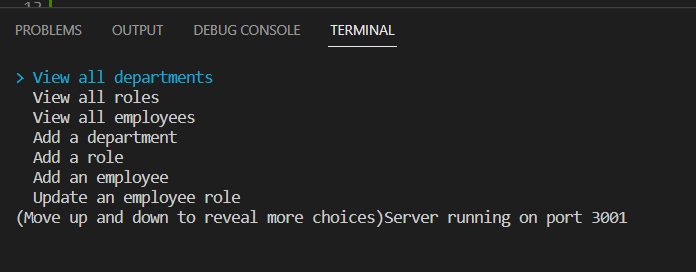

# SQL-Employee-Tracker

## Description
This application is run in the terminal using Node and MYSQL. The user is able to view and manage their employees, departments, and roles for each employee. 

## Screenshots

[Video Walkthrough](https://drive.google.com/file/d/1vSmBldAJZXdh12sM562pWM8BF3AhTIdM/view)

## Installation
To run the application, in the db folder run Mysql then run "SOURCE schema.sql;" and if you want the seed data, then also run "SOURCE seeds.sql;"

Next, in the root folder, open the terminal and run "npm i" and then "node server.js" to run the program

## Questions
For any question, feel free to email me at tshadday99@gmail.com. Check out my other GitHub applications: [tshadday](https://github.com/tshadday)